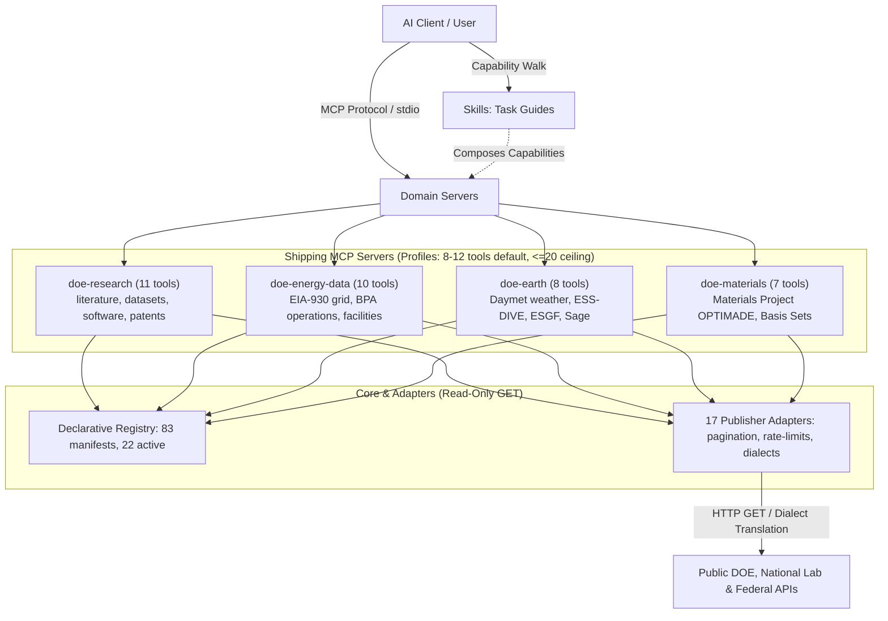

# DOE-MCP

**MCP servers over public US Department of Energy and national-laboratory
data. Every answer names the systems it came from, when they were read, and
what it did not cover.**

> **Not affiliated with the US Department of Energy.** DOE-MCP is an
> independent, community-run project. It is not endorsed by, funded by, or
> connected to DOE, the NNSA, any program office, any national laboratory, or
> any Power Marketing Administration. "DOE" names the data, not the origin.
> No answer this software returns is an official government statement.

DOE and its 17 national laboratories publish a large body of public data, and
almost none of it is reachable over the Model Context Protocol. This project
covers it by **data domain** over a declarative source registry, and puts a
provenance envelope on every answer so a caller can check where it came from
and what it does not cover.

- **Use it.** [Install](#install), connect a client, ask a question. The
  literature vertical needs no credential. See [examples/README.md](examples/README.md)
  for workflows across all four servers.
- **Contribute.** The most useful contribution is a source manifest, not
  code. [CONTRIBUTING.md](CONTRIBUTING.md) has the rules for people;
  [AGENTS.md](AGENTS.md) has the ones coding agents follow.
- **Understand it.** [design/architecture.md](design/architecture.md) opens
  with what is built, then the system, then one record per architectural
  choice with the losing options kept. [docs/reference.md](docs/reference.md)
  lists every tool and argument, read back from the assembled servers.

## Status

Early. Four servers work against live endpoints: the research vertical
(literature, datasets, software, rulemakings, patents), the energy-data
vertical (EIA, BPA, the wind and solar inventories, fuel economy), the earth
server (Daymet, ESS-DIVE, the ESGF index, the Sage node inventory), and the
materials server (OPTIMADE structures, basis sets). The other science
domains are registry inventory with named next steps. The table below is
generated from the registry the servers run on, and CI fails when it
drifts. [WORKLOG.md](WORKLOG.md) opens with the open gaps.

<!-- status:begin -->
<!-- Generated by tools/build_site.py from the registry the servers run on. Edit the registry, not this block. -->
| | |
|---|---|
| Servers shipping | `doe-research` (11 tools, `research:default`), `doe-energy-data` (10 tools, `energy:default`), `doe-earth` (8 tools, `earth:default`), `doe-materials` (7 tools, `materials:default`) |
| Registry | 83 source manifests, 22 active, 54 organizations (17 national laboratories), 5 sub-MCP catalog entries |
| Capabilities | 33 of 51 in the vocabulary served by an active source |
| Adapters | `basis_sets`, `curated`, `daymet`, `eia_v2`, `esgf`, `essdive`, `federal_register`, `fueleconomy`, `json_document`, `opendatasoft`, `optimade`, `osti_family`, `postgrest`, `sage`, `self_registry`, `text_feed`, `vips` |
| Verified live | Sage / Waggle edge sensor network, Basis Set Exchange, BPA transmission operations feeds, DOE Software Inventory (code.json), DOE Open Data Catalog (data.json), EIA API v2, ESGF search (CMIP6), ESS-DIVE (Environmental System Science Data Infrastructure), Federal Register API (Department of Energy documents), fueleconomy.gov web service, Materials Project OPTIMADE endpoint, ORNL DAAC (Daymet, MODIS/VIIRS subsets), Open Energy Data Hub (ORNL), DOE Data Explorer, DOE CODE, DOE PAGES (Public Access Gateway for Energy and Science), OSTI.GOV Search API, VIPS (DOE patent and software database), US Large-Scale Solar Photovoltaic Database (USPVDB), US Wind Turbine Database (USWTDB) |
| Not verified | none |
| Records reachable with no credential | 20,176,445 |
| Registry revision | 2026-09-09 |
<!-- status:end -->

## Install

Not on PyPI yet. Install from a checkout of this repository, from its root:

```bash
pipx install .
```

For development, with the test dependencies:

```bash
uv venv --python 3.12 && uv pip install -e ".[all]" --group dev
```

Then check the install and register the servers with a client:

```bash
doe-mcp doctor
doe-mcp configure claude-code        # or claude-desktop, vscode, cursor
```

`doe-mcp configure claude-code --all` registers every server at once. Where a
source needs a key, it goes in your own credentials file through `doe-mcp
configure credentials`, never into a client config.

## Try it from the command line

```bash
doe-mcp tools call research.search_literature \
  --args '{"query": "perovskite tandem solar cell", "year_from": 2024, "rows": 3}'
```

The answer is a complete envelope: the records under `data`, the OSTI
collections that were searched under `provenance`, one `evidence` entry per
record, and `coverage.pagination` set to `truncated`, because far more
matches exist than the three returned. No credential is involved.

## Questions it takes

| Question | Tool |
|---|---|
| What DOE-funded work exists on perovskite tandem cells? | `research.search_literature` |
| Where is the dataset behind this paper, and what is its DOI? | `research.search_datasets` |
| Has a national laboratory released Python code for lattice QCD? | `research.search_software` |
| Can I read the full text, and where? | `research.get_record` |
| What does Oak Ridge publish? | `registry.lab_crosswalk` |
| I have an old NREL URL that 404s. What happened? | `registry.resolve_org` |
| Which DOE catalog holds the EAGLE-I outage data? | `discovery.search_all_catalogs` |
| What are DOE's own designated durable data resources? | `discovery.list_pure_resources` |
| Does DOE-MCP cover geothermal, and if not, why not? | `registry.search_sources` |
| How much electricity did CAISO demand last night? | `energy.grid_status` |
| What does this car actually get? | `fuel.find_vehicle` |
| What is BPA's load and wind generation right now? | `grid.get_bpa_operations` |
| Which wind turbines and solar farms are inside this bounding box? | `facility.find_wind_turbines`, `facility.find_solar_facilities` |
| What has DOE proposed or finalized on appliance standards this year? | `docs.search_rulemakings` |
| What can I license from Oak Ridge? | `tech.find_licensable_ip` |
| What was the weather at these coordinates every day last summer? | `earth.get_daymet_point` |
| What data exists from the NGEE Arctic campaign, and who produced it? | `earth.search_datasets`, `earth.get_dataset` |
| Which climate models ran the historical experiment for surface temperature? | `climate.discover_facets`, `climate.search_cmip` |
| Where are the air-quality sensors near this city, and what is on them? | `sensors.find_nodes` |

## Architecture

DOE-MCP layers agent workflows over focused domain servers, typed tools, and
GET-only publisher adapters:



Every response returns a structured provenance envelope:

## The envelope

Every tool returns `{data, provenance, evidence, coverage, warnings, ...}`.
The part that matters most is `coverage`, which has five independent
dimensions that are never collapsed into one status:

```json
{"registry": "covered", "execution": "complete", "pagination": "truncated",
 "source_claim": "partial", "result": "hit"}
```

`result: "empty"` with `registry: "covered"` means the searched systems hold
no record. `registry: "none"` means DOE-MCP has no source for that question
and the data may well exist. Conflating those two is the most damaging thing
a government-data tool can do to someone relying on it.

DOE's additions to the inherited contract: a **citation block** (several
publishers require citation as a condition of use), a required
**`dataset_version`** (ATB 2024 and ATB 2026 are different data with the same
name), typed **access recipes** for data too big to inline, and three warning
codes for confusions this ecosystem actually produces: `derived_layer`,
`catalog_vintage`, `domain_migrated`.

## Licensing

Code Apache-2.0. **The source registry under `sources/` is CC0**: the
inventory of what exists, who stewards it, and what its terms say is more
useful unencumbered. Docs CC-BY-4.0. See [NOTICE](NOTICE).

## Lineage

The packaging shape (one pip package, many focused stdio servers, the
doctor/configure CLI) is borrowed with thanks from **PNNL's NEPA-MCP**. That
project does not endorse this one.
